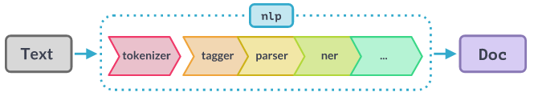

# Python for Linguists

## Class 10
1. Mini-exam 9 + discussion
2. Admin: homework time? exam info; looking ahead
3. Homework discussion: Sec. 15 (read/write), 16 (sort/count), 17-17.37 (regex)

--- break

4. Finish similarity adventure (gensim)
5. Intro NLP pipeline
6. Homework for next time: 17.38-end, 18-18.30 (spaCy)
------

## Homework discussion
...

## Similarity adventure notes
- Recap of basic idea.
- Dimensionality reduction.
- Library: Gensim. 
- State of the art?

## NLP pipeline (with spaCy)

