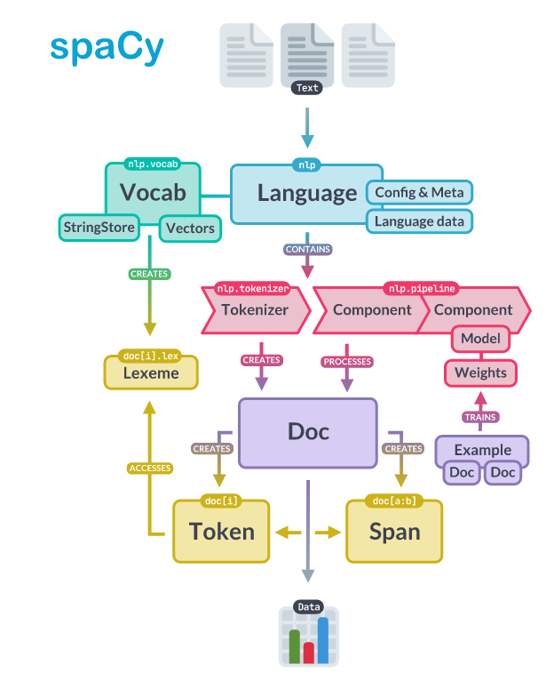

# Python for Linguists

## Class 11
1. Mini-exam 10 + discussion
2. Admin: homework time? (## hours)
3. Homework discussion: Sec 17.38-end (regex), 18-18.30 (spacy)

--- break ---

4. Machine learning
5. Homework for next time: 18.31-38 (adventure), 19 (some more builtins), 20 (clearer code)
------

## spaCy architecture:

## Natural language processing

https://en.wikipedia.org/wiki/Natural_language_processing

## Machine learning
  - Supervised
  - Unsupervised
  - Reinforcement learning

### Training
- Gradient descent
- Loss function 
- Backpropagation
- Training, validation, testing

### Inputs
- Pre-computed features (feature engineering)
- 'Raw' inputs (feature learning/Representation learning)

### Regression (next week's adventure)

...

### Why "Regression?"

From _Francis Galton (1886). Regression toward mediocrity in heriditary stature._

