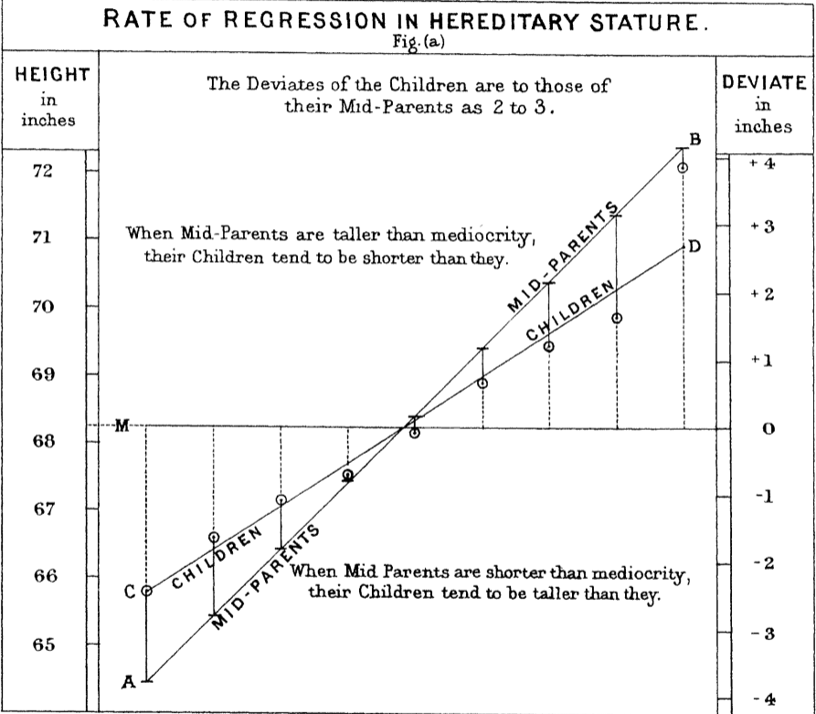
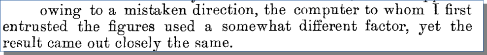

# Python for Linguists

## Class 12
1. Mini-exam 11 + discussion
2. Admin: homework time? 4 / exam in computer room
3. Homework discussion: 18.31-38 (adventure), 19 (some more builtins), 20 (clearer code)

--- break ---

4. Machine learning adventure: sentiment analysis
5. See the new 'Where next?' exercises section.
6. Course evaluation:    https://evasys.leidenuniv.nl/evasys/online.php?p=6PMJ7
------

### Homework discussion notes

all: everything iterated over evaluates to true (vacuously true if no elements)
any: something iterated over evaluates to true (implies existence)

refactoring (shift+f6)

### Machine learning

precision = proportion of predicted 'positive' that are actually positive.
recall = proportion of actual positive, that are predicted to be 'positive'.
f1 = harmonic mean of precision and recall

1 / (1 / precision + 1 / recall)

### Why "Regression?"

From _Francis Galton (1886). Regression toward mediocrity in heriditary stature._

