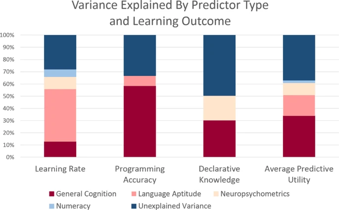
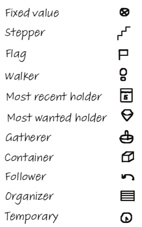

# Python for Linguists

## Class 6
1. Mini-exam 5 + discussion
2. Admin: 
   - homework time? (5-6 hours);
   - solutions: yay or nay? yay!
   - mini-exam will be in-class-but-digital next time (if programming).
3. Questions about homework (8.11-9.9)? Current frustrations/mysteries?
4. Short lecture: roles of variables

---break---

6. Quick review of previous adventure: Concreteness and correlation.
7. New adventure: Frequencies
8. Homework for next time:
   - Section 9.10-end (loops) and 10.1-11.14 (function fundamentals)
   - Be aware of variable roles (see below).
   - Also: Try to make the adventure code run on your computer.

------


### 6.1. Natural language vs. Python



From _Relating Natural Language Aptitude to Individual Differences in Learning Programming Languages_ (https://www.nature.com/articles/s41598-020-60661-8)


### 6.2. Roles of variables



From Hermans (2020) _The Programmer's Brain_ (https://www.universiteitleiden.nl/en/research/research-output/science/the-programmers-brain).
See also e.g. _An Experiment on Using Roles of Variables in Teaching Introductory Programming_ (https://www.tandfonline.com/doi/pdf/10.1080/08993400500056563).

```python
upper_bound = 10                  # fixed
sum_of_squares = 0                # gatherer 
for i in range(upper_bound):      # stepper      
    sum_of_squares += i ** 2
    
names = ['Alf', 'Beth', 'Gemma']   # fixed     

current_longest = ''               # most wanted holder   
for name in names:                 # most recent holder     
    if len(name) > len(current_longest):
        current_longest = name

contains_vowel_name = False        # flag     
for name in names:                 # most recent holder
    if name[0].lower() in 'aeiou':
        contains_vowel_name = True

number = 12348                      # fixed
contains_even_digit = False         # flag
number_as_str = str(number)        # organizer    
for digit in number_as_str:         # most recent holder
    if int(digit) % 2 == 0:
        contains_even_digit = True
        
x = 5
y = 6
old_x = x                   # temporary               
x = y
y = old_x

numbers = [1, 5, 4, 3, 8, 7, 6]     # fixed
even_numbers = []                   # container    
for number in numbers:
    if number % 2 == 0:
        even_numbers.append(number)

```